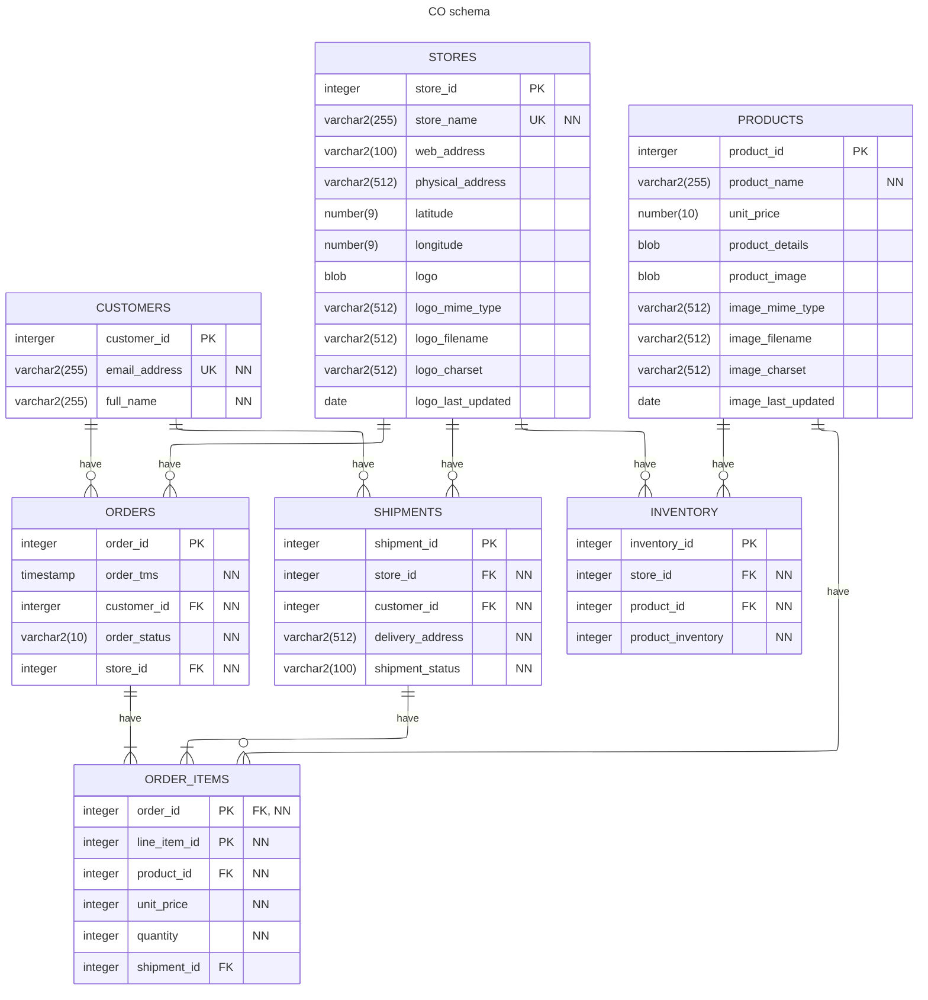

# Customer Orders Sample Schema

## Schema Description

Customer Orders (`CO`) is a sample schema resembling a generic
customer orders management schema.
The Customer Orders (`CO`) schema records the details of transactions made by
a retail application.

The `CO` schema highlights features such as JSON support.

The company sells a variety of products, which are maintained in the `products`
table. Each product has a unique identification number, name, price, details
stored in a JSON object and product image details.

The orders placed by the customer are tracked in the `orders` table using the
order identification number, date and time when the order was placed,
customer details, order status and the store information.

The details of the products in a particular order are also tracked in the
`order_items` table using the order identification number. Details of the
products, price at the time of purchase, quantity and shipment are recorded.

The information of a customer placing an order is tracked in the `customers`
table. Each customer has an identification number, name, and email address
that is used for communication of the orders.

The customers can purchase the products in stores or online through the
company's website. The information for all of the stores and their
corresponding physical and virtual addresses is tracked in the `stores`
table. The store information is also recorded in the order details.

The shipment details of the orders placed such as the delivery address,
customer details, store information and the shipment status are stored
in the `shipments` table.

An `inventory` table stores the details of each product such as the quantity
available at each store.

## Install Instructions

1. Connect as privileged user with rights to create another user (`SYSTEM`, `ADMIN`, etc.)
2. Run the `co_install.sql` script to create the `CO` (Customer Orders) schema
3. You are prompted for:
   1. `password` - enter an Oracle Database compliant password
   2. `tablespace` - if you do not enter a tablespace, the default database tablespace is used

**Note:** If the CO schema already exists, it is removed/dropped and
a fresh CO schema is installed

### Dependencies and Requirements

- Oracle Database 19c and higher
- Access to `co_install.sql`, `co_create.sql`, `co_populate.sql`
- Scripts need to be run as a privileged user with rights to create and drop another user (`SYSTEM`, `ADMIN`, etc.).

## Uninstall Instructions

1. Connect as privileged user with rights to drop another user (`SYSTEM`, `ADMIN`, etc.)
2. Run the `co_uninstall.sql ` script to remove the `CO` (Customer Orders) schema

## Schema Details

### Schema Objects

| Object Type | Objects |
| ----------- | ------- |
| Index       | `customers_name_i`, `orders_customer_id_i`, `orders_store_id_i`, `products_pk`, `stores_pk`, `store_name_u`, `customers_pk`, `customers_email_u`, `orders_pk`, `order_items_pk`, `order_items_product_u`, `inventory_product_id_i`, `inventory_pk`, `inventory_store_product_u`, `shipments_store_id_i`, `shipments_customer_id_i`, `shipments_pk` |
| Table       | `customers`, `stores`, `products`, `orders`, `order_items`, `shipments`, `inventory` |
| View        | `customer_order_products`, `store_orders`, `product_reviews`, `product_orders` |

### Table Descriptions

#### `CUSTOMERS`

| Name            | Null       | Type            | Relationships |
| --------------- | ---------- | --------------- | ------------- |
| `CUSTOMER_ID`   | `NOT NULL` | `INTEGER`       | relates each row of the table `customers` to none or more rows of `customer_id` in the `orders` table. |
| `EMAIL_ADDRESS` | `NOT NULL` | `VARCHAR2(255)` | |
| `FULL_NAME`     | `NOT NULL` | `VARCHAR2(255)` | |

#### `STORES`

| Name                | Null       | Type            | Relationships |
| ------------------- | ---------- | --------------- | ------------- |
| `STORE_ID`          | `NOT NULL` | `INTEGER`       | relates each row of the table `stores` to none or more rows of `store_id` in the `customers` table. |
| `STORE_NAME`        | `NOT NULL` | `VARCHAR2(255)` | |
| `WEB_ADDRESS`       |            | `VARCHAR2(100)` | |
| `PHYSICAL_ADDRESS`  |            | `VARCHAR2(512)` | |
| `LATITUDE`          |            | `NUMBER(9,6)`   | |
| `LONGITUDE`         |            | `NUMBER(9,6)`   | |
| `LOGO`              |            | `BLOB`          | |
| `LOGO_MIME_TYPE`    |            | `VARCHAR2(512)` | |
| `LOGO_FILENAME`     |            | `VARCHAR2(512)` | |
| `LOGO_CHARSET`      |            | `VARCHAR2(512)` | |
| `LOGO_LAST_UPDATED` |            | `DATE`          | |

#### `PRODUCTS`

| Name                 | Null       | Type            | Relationships |
| -------------------- | ---------- | --------------- | ------------- |
| `PRODUCT_ID`         | `NOT NULL` | `INTEGER`       | relates each row of the table `products` to none or more rows of `product_id` in the `order_items` table. |
| `PRODUCT_NAME`       | `NOT NULL` | `VARCHAR2(255)` | |
| `UNIT_PRICE`         |            | `NUMBER(10,2)`  | |
| `PRODUCT_DETAILS`    |            | `BLOB`          | |
| `PRODUCT_IMAGE`      |            | `BLOB`          | |
| `IMAGE_MIME_TYPE`    |            | `VARCHAR2(512)` | |
| `IMAGE_FILENAME`     |            | `VARCHAR2(512)` | |
| `IMAGE_CHARSET`      |            | `VARCHAR2(512)` | |
| `IMAGE_LAST_UPDATED` |            | `DATE`          | |

#### `ORDERS`

| Name           | Null       | Type            | Relationships |
| -------------- | ---------- | --------------- | ------------- |
| `ORDER_ID`     | `NOT NULL` | `INTEGER`       | relates each row of the table `orders` to none or more rows of `order_id` in the `order_items` table. |
| `ORDER_TMS`    | `NOT NULL` | `TIMESTAMP(6)`  | |
| `CUSTOMER_ID`  | `NOT NULL` | `INTEGER`       | relates none or more rows of the table `orders` to the corresponding values in the `customer_id` column of the table `customers`. |
| `ORDER_STATUS` | `NOT NULL` | `VARCHAR2(10)`  | |
| `STORE_ID`     | `NOT NULL` | `INTEGER`       | relates none or more rows of the table `orders` to the corresponding values in the `store_id` column of the table `stores`. |

#### `ORDER_ITEMS`

| Name           | Null       | Type           | Relationships |
| -------------- | ---------- | -------------- | ------------- |
| `ORDER_ID`     | `NOT NULL` | `INTEGER`      | relates each row of the table `order_items` to exactly one value of `order_id` in the `orders` table. |
| `LINE_ITEM_ID` | `NOT NULL` | `INTEGER`      | |
| `PRODUCT_ID`   | `NOT NULL` | `INTEGER`      | relates each row of the table `order_items` to exactly one value of `product_id` in the `products` table. |
| `UNIT_PRICE`   | `NOT NULL` | `NUMBER(10,2)` | |
| `QUANTITY`     | `NOT NULL` | `INTEGER`      | |
| `SHIPMENT_ID`  |            | `INTEGER`      | |

#### `SHIPMENTS`

| Name               | Null       | Type            | Relationships |
| ------------------ | ---------- | --------------- | ------------- |
| `SHIPMENT_ID`      | `NOT NULL` | `INTEGER`       | |
| `STORE_ID`         | `NOT NULL` | `INTEGER`       | |
| `CUSTOMER_ID`      | `NOT NULL` | `INTEGER`       | |
| `DELIVERY_ADDRESS` | `NOT NULL` | `VARCHAR2(512)` | |
| `SHIPMENT_STATUS`  | `NOT NULL` | `VARCHAR2(100)` | |

#### `INVENTORY`

| Name                | Null       | Type      | Relationships |
| ------------------- | ---------- | ----------| ------------- |
| `INVENTORY_ID`      | `NOT NULL` | `INTEGER` | |
| `STORE_ID`          | `NOT NULL` | `INTEGER` | |
| `PRODUCT_ID`        | `NOT NULL` | `INTEGER` | |
| `PRODUCT_INVENTORY` | `NOT NULL` | `INTEGER` | |

### Schema Diagram



## License

```
Copyright (c) 2023 Oracle and/or its affiliates. All rights reserved.

Permission is hereby granted, free of charge, to any person obtaining a
copy of this software and associated documentation files (the "Software"),
to deal in the Software without restriction, including without limitation
the rights to use, copy, modify, merge, publish, distribute, sublicense,
and/or sell copies of the Software, and to permit persons to whom the
Software is furnished to do so, subject to the following conditions:

The above copyright notice and this permission notice shall be included in
all copies or substantial portions rem of the Software.

THE SOFTWARE IS PROVIDED "AS IS", WITHOUT WARRANTY OF ANY KIND, EXPRESS OR
IMPLIED, INCLUDING BUT NOT LIMITED TO THE WARRANTIES OF MERCHANTABILITY,
FITNESS FOR A PARTICULAR PURPOSE AND NONINFRINGEMENT. IN NO EVENT SHALL
THE AUTHORS OR COPYRIGHT HOLDERS BE LIABLE FOR ANY CLAIM, DAMAGES OR OTHER
LIABILITY, WHETHER IN AN ACTION OF CONTRACT, TORT OR OTHERWISE, ARISING
FROM, OUT OF OR IN CONNECTION WITH THE SOFTWARE OR THE USE OR OTHER
DEALINGS IN THE SOFTWARE.
```
